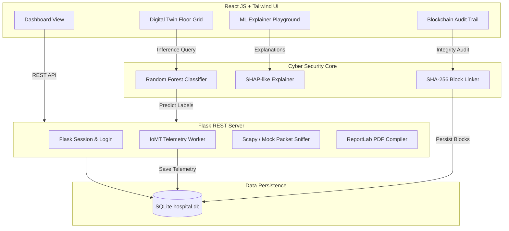
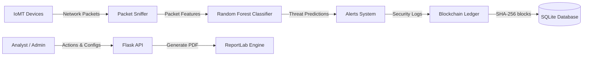
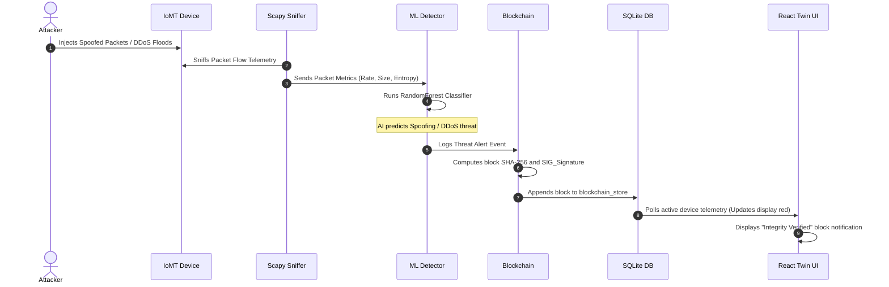
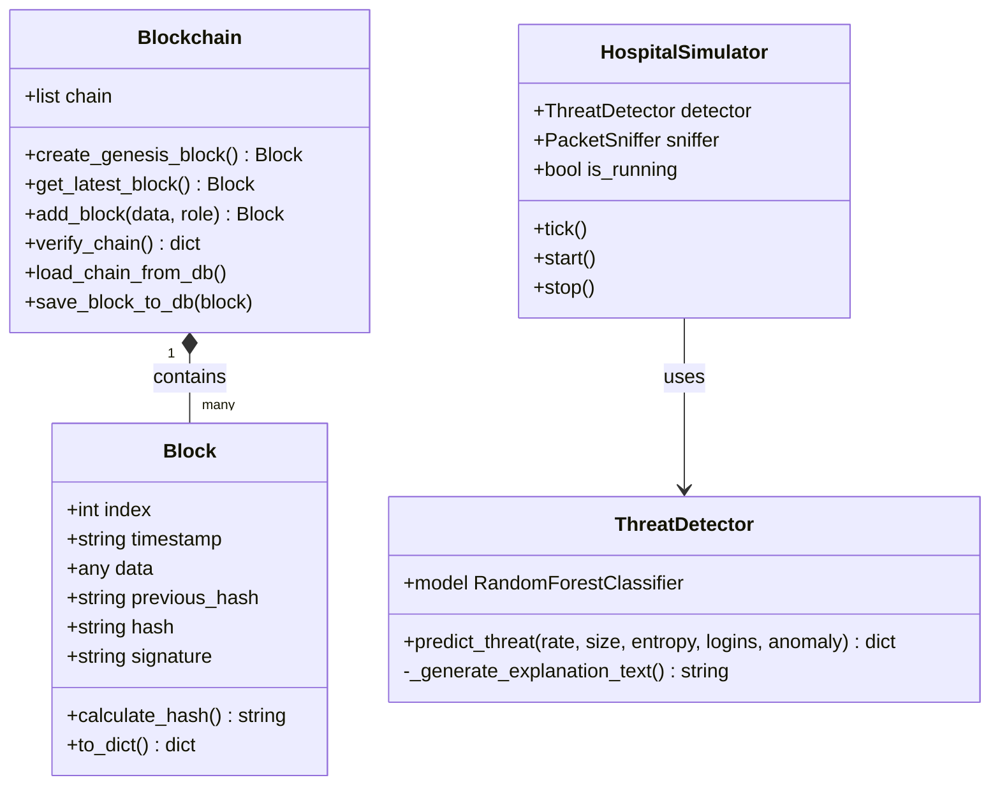
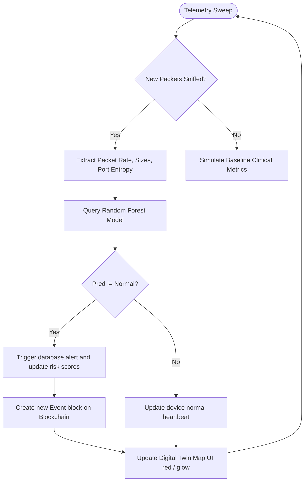

# MedShield Twin: AI-Powered Secure Hospital Digital Twin

An advanced, full-stack cybersecurity digital twin dashboard designed to monitor and protect smart hospital networks.

MedShield Twin simulates a smart hospital environment containing Internet of Medical Things (IoMT) endpoints, evaluating packet flows using **Machine Learning (Random Forest)** and sealing audit registers inside a **Python SHA-256 Blockchain**.

---

## 1. System Diagrams (Mermaid)

### Architecture Diagram


### Data Flow Diagram (DFD - Level 1)


### Entity Relationship (ER) Diagram
```mermaid
erDiagram
    USERS {
        int id PK
        string username UNIQUE
        string password_hash
        string role
    }
    DEVICES {
        string id PK
        string name
        string room
        string ip_address
        string mac_address
        string status
        int risk_score
        int heart_rate
        float temperature
        string blood_pressure
    }
    ALERTS {
        int id PK
        string device_id FK
        string severity
        string message
        string timestamp
    }
    LOGS {
        int id PK
        string log_type
        string message
        string timestamp
        string details
    }
    BLOCKCHAIN_STORE {
        int block_index PK
        string timestamp
        string data
        string previous_hash
        string current_hash
        string signature
    }
```

### Sequence Diagram: Attack Detection & Logging


### Class Diagram


### Use Case Diagram
```mermaid
leftToRightDirection
actor Guest as "Guest User"
actor Analyst as "Security Analyst"
actor Admin as "Administrator"

rectangle MedShield_System {
    usecase UC_Monitor as "Monitor Digital Twin Floor Map"
    usecase UC_ViewBC as "View Blockchain Ledgers"
    usecase UC_AuditBC as "Verify Ledger Integrity"
    usecase UC_Report as "Generate Forensic PDF Report"
    usecase UC_SimAttack as "Inject Attack Simulations"
    usecase UC_Devices as "Manage Device Registries"
    usecase UC_Users as "Register Operators & Analysts"
}

Guest --> UC_Monitor
Guest --> UC_ViewBC

Analyst --> UC_Monitor
Analyst --> UC_ViewBC
Analyst --> UC_AuditBC
Analyst --> UC_Report
Analyst --> UC_SimAttack

Admin --> UC_Monitor
Admin --> UC_ViewBC
Admin --> UC_AuditBC
Admin --> UC_Report
Admin --> UC_SimAttack
Admin --> UC_Devices
Admin --> UC_Users
```

### Threat Detection Logic Flowchart


---

## 2. Installation Guide

### Prerequisites
- **Python**: v3.11+ (v3.12 verified)
- **Node.js**: v20+ (v22 verified)
- **npm**: v10+
- **Npcap/WinPcap** (Optional: Required if capturing live local WiFi packets using Scapy, otherwise the system runs using the simulated traffic fallback).

### Backend Setup
1. Open a terminal in the project root folder.
2. Install Python dependencies:
   ```bash
   pip install flask flask-cors flask-login bcrypt scikit-learn pandas scapy reportlab
   ```
3. Initialize the database and train the ML classifier model:
   ```bash
   python database/db_manager.py
   python machine_learning/train.py
   ```
4. Start the Flask server:
   ```bash
   python backend/app.py
   ```
   *The Flask API server will launch at `http://127.0.0.1:5000`.*

### Frontend Setup
1. Open a separate terminal in the `frontend` folder.
2. Install npm node modules:
   ```bash
   npm install
   ```
3. Start the Vite React development server:
   ```bash
   npm run dev
   ```
   *The React UI console will launch at `http://localhost:5173`.*

---

## 3. User Manual

### Login Credentials
Three roles are pre-seeded in the database:
- **Admin**:
  - Username: `admin` | Password: `admin123`
  - *Privileges: Full access, adding/removing devices, registering users, database configurations.*
- **Security Analyst**:
  - Username: `analyst` | Password: `analyst123`
  - *Privileges: Monitoring map, running integrity audits, generating PDF reports, launching attacks.*
- **Guest**:
  - Username: `guest` | Password: `guest123`
  - *Privileges: Read-only access to floor maps and logs.*

### Navigating the Console
1. **Landing Page**: Main portal describing capabilities. Click **Access System** to proceed to login.
2. **Dashboard**: Evaluates global stats (active threats, offline nodes, and block counts). Holds quick links to download reports or inject telemetry scans.
3. **Digital Twin Map**: Spatial grid displaying 10 hospital rooms. Select a room to view devices. Select a device (e.g. ICU Ventilator) to see changing heart rate / temperature indicators. Use the bottom panel to trigger DDoS or Spoofing attacks on that specific device.
4. **Network Sniffer**: Live stream scrolling packet log. You can search by IP or filter by protocols (TCP/UDP).
5. **AI Classifier Playground**: Slide packet values (like failed logins or entropy rates) to test prediction changes on the Random Forest classifier. Explains features using SHAP-like percentage contributions.
6. **Blockchain Ledger**: Check linked cards. Click **Audit Ledger Integrity** to verify hashes. Use the right-hand form to tamper with a block's data directly in SQLite, then rerun the audit to show the ledger validation fail.

---

## 4. Technical Manual

### SQLite Schemas
Persists state in `database/hospital.db` with 5 main tables:
- `users`: stores hashed login keys using `bcrypt`.
- `devices`: tracks room placements, IP/MAC, and clinical telemetry (HR, Temp, BP).
- `alerts`: records AI flagged threats with severity tags.
- `logs`: maintains system, user, and blockchain activities audit histories.
- `blockchain_store`: stores the serialized blocks (index, hashes, data payloads, signatures).

### Random Forest Classification Features
We classify traffic into 6 categories based on 5 numerical variables:
1. `packet_rate`: high rate flags **DDoS** (flood).
2. `packet_size_avg`: high sizes flag **Botnet** (data extraction), small sizes flag **Port Scan**.
3. `port_entropy`: high entropy flags **Port Scan** (sweeping ports).
4. `failed_logins`: high login failures flag **Brute Force** console cracking.
5. `payload_anomaly`: elevated scores flag **Spoofing** (exploit characters).

### Blockchain Cryptography
- **Chaining**: Every Block class calculates its hash via:
  $$Hash = \text{SHA256}(Index + Timestamp + Data + PrevHash + Signature)$$
- **Integrity Audit**: The `verify_chain()` loop compares:
  $$\text{CurrentBlock.hash} \stackrel{?}{=} \text{CurrentBlock.calculate\_hash}()$$
  $$\text{CurrentBlock.previous\_hash} \stackrel{?}{=} \text{PreviousBlock.hash}$$
  If either matches fail, the chain is broken, indicating SQL database database manipulation.
